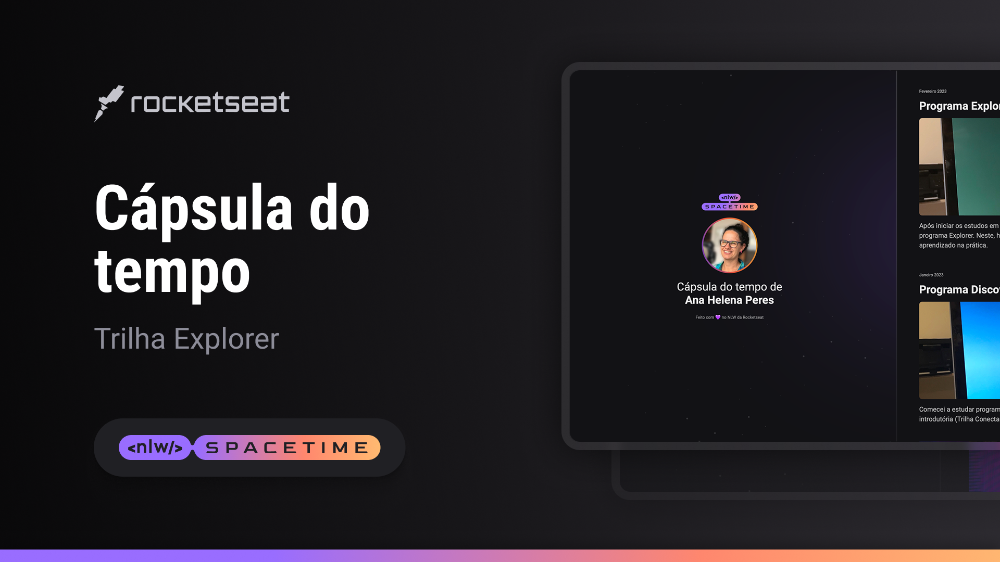

  

## 💻 Projeto
Esse é um projeto responsivo de uma cápsula do tempo.

## 🚀 Tecnologias
Esse projeto foi desenvolvido durante o NLW da Rocketseat, usando as seguintes tecnologias:

- HTML
- CSS
- Git e GitHub

## 🏷️ Layout
Você pode conferir o layout desse projeto [clicando aqui](https://www.figma.com/file/G8D1vz2YLRndYRjG1YuoAZ/C%C3%A1psula-do-tempo-%E2%80%A2-Trilha-Explorer-(Community)-(Copy)?type=design&node-id=352%3A8&t=zDzql1e37ldHQfdD-1)
É necessário ter uma conta no [Figma](https://www.figma.com/).